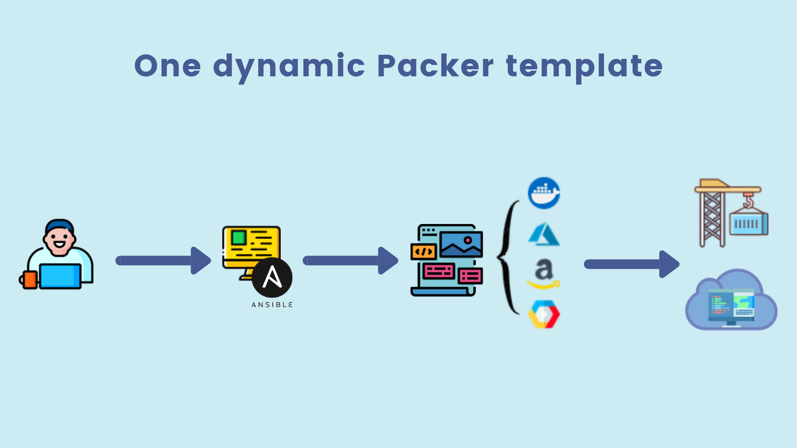
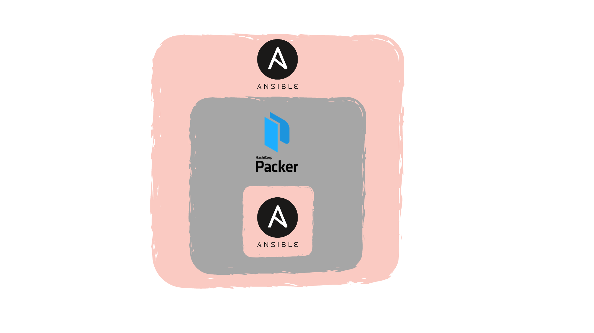
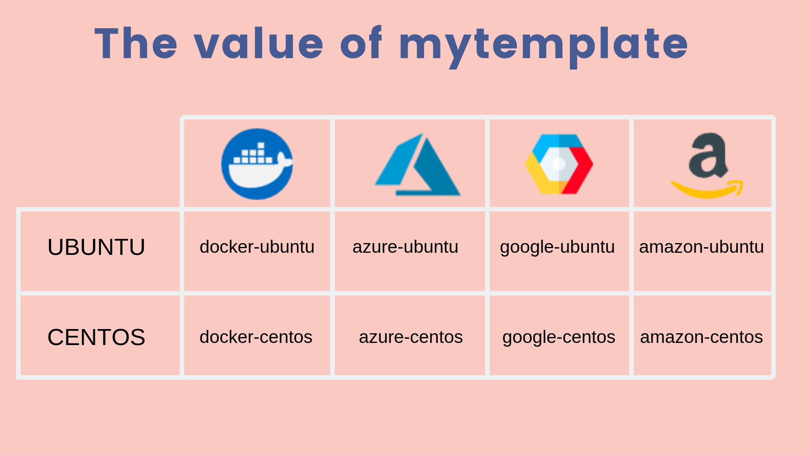

# Packer Universal Image Builder
----------------------------------

**Packer Universal Image Builder**, is an Ansible playbook which creates a packer template for Docker or any cloud provider with any operating system. The template is generated by just one command and it can be provisioned by Shell or Ansible.

## Overview
----------------------------------


## Requirements
----------------------------------
- OS Centos or Ubuntu
- Ansible 2.8.4
- Packer 1.4.2
- Docker 19.03.1

## Source code structure
----------------------------------
```bash
.
├── docker                   <-- Docker role to install Docker on your machine
│   ├── tasks
│   │   └── main.yml
│   └── vars
│       └── main.yml
├── image_builder
│   ├── tasks
│   │   └── main.yml         <--This create a folder in the root user with the generated template
│   ├── templates
│   │   └── template.json.j2 <--This is the dynamic template
│   └── vars
│       └── main.yml         <-- This is where you have to put your cloud provider credentials
└── packer                   <-- Packer role to install Packer on your machine
    ├── tasks
    │   └── main.yml
    └── vars
        └── main.yml
```

## Installation
---------------------------------

First, you need to install [Ansible](https://www.ansible.com/) on your machine.

```bash
DEBIAN

apt-get update
apt-get install software-properties-common
apt-add-repository ppa:ansible/ansible
apt-get update
apt-get install ansible

REHL

yum install epel-release
yum install Ansible

Mac OS

brew install ansible

With pip

pip install ansible
```

Then, you need to install [Packer](https://www.packer.io/).

```bash
wget https://releases.hashicorp.com/packer/1.4.2/packer_1.4.2_linux_amd64.zip
unzip packer_1.4.2_linux_amd64.zip
mv packer /usr/local/bin
rm -f packer_1.4.2_linux_amd64.zip
```
Finally, you need to install [Docker](https://www.docker.com/).

```bash
DEBIAN

apt-get update
apt-get install apt-transport-https ca-certificates curl gnupg2 software-properties-common
curl -fsSL https://download.docker.com/linux/debian/gpg | sudo apt-key add -
add-apt-repository "deb[arch=amd64] https://download.docker.com/linux/debian $(lsb_release -cs) stable"
apt-get update
apt-get install docker-ce docker-ce-cli containerd.io

REHL

yum install -y yum-utils device-mapper-persistent-data lvm2
yum-config-manager --add-repo https://download.docker.com/linux/centos/docker-ce.repo
yum install docker-ce docker-ce-cli containerd.io
systemctl start docker
```
You can also install [Packer](https://www.packer.io/) and [Docker](https://www.docker.com/) by running the playbook deploy_installation.yaml after installing [Ansible](https://www.ansible.com/).

```yaml
ansible-playbook deploy_installation.yaml
```
Likewise, you can download Puib docker image with [Packer](https://www.packer.io/) and [Ansible](https://www.ansible.com/) already installed. However, [Docker](https://www.docker.com/) can not run because a container don't have a systemd.
```bash
docker pull aminetity/puib:0.1
docker run -it aminetity/puib:0.1
```


## Usage
---------------------------------


The playbook use only one variable **mytemplate** which refer to the type of image and operating system that you would like to build. You can find bellow the different options that you may use. Nonetheless, feel free to add any other cloud provider or operating system that are supported by packer.



After choosing the value of **mytemplate** you can enter your **credentials** and **the path of the Ansible playbook** that you would like to use for provisioning   execute this command to generate your template and build it.

This is an example of building an **Azure centos** image, please run these commands as **root**:
```bash
git clone https://github.com/Wefactorit/ANS_puib.git
cd puib
ansible-playbook deploy_image_builder.yaml --extra-vars "mytemplate=azure-centos"
```


## Variables
-----------------------------------------------

#### GENERAL

| Name | Description | Type | Default | Required |
|------|-------------|:----:|:-----:|:-----:|
| mytemplate | Variable to point the type of the template and the OS | string | - | yes |
| vm_type_name | The property type name | string | - | yes |
| image_type | The builder type name| string | - | yes |
| provisioners_type_shell | Shell provisioner type  | string | shell | yes |
| provisioners_type_ansible | Ansible provisioner type | string | ansible-local | yes |
| provisioners_playbook | The path of the ansible playbook designated for provisioning  | string | - | yes |
| provisioners_extravars | The extra variables for the ansible playbook  | string | - | no |
| command_rehl | List of commands used for provisioning for a Rehl OS | string | - | yes |
| command_debian | List of commands used for provisioning for a Debian OS | string | - | yes |


#### AZURE

| Name | Description | Type | Default | Required |
|------|-------------|:----:|:-----:|:-----:|
| template_azure | The object variable | string | - | yes |
| client_id | The client key of the Azure service account| string | - | yes |
| client_secret | The secret password of the Azure service account | string | - | yes |
| subscription_id | The subscription id of the Azure account | string | - | yes |
| tenant_id | The tenant id of the the Azure service account | string | - | yes |
| resource_group | The resource group name where the template will be deployed | string | - | yes |
| packer_image_name | The name of the customized image | string | - | yes |
| vm_size | The type of the Azure virtual machine | string | - | yes |
| azure_tag_dept | Tag to organize your Azure resources | string | - | no |
| azure_tag_task | Tag to organize your Azure resources | string | - | no |
| os_type | Azure VM OS type | string | - | yes |
| image_publisher | Azure VM image publisher | string | - | yes |
| image_offer | Azure VM image offer | string | - | yes |
| image_sku | Azure VM image sku | string | - | yes |
| resource_group_shared_gallery | Shared gallery resource group | string | - | no |
| gallery_name | Shared image gallery name | string | - | no |
| image_definition | Shared image gallery image definition | string | - | no |
| replication_regions | Shared image gallery replication regions | string | - | no |
| share | Variable to allow the use of Azure shared image gallery | boolean | false | no |


#### GOOGLE

| Name | Description | Type | Default | Required |
|------|-------------|:----:|:-----:|:-----:|
| account_file | Google credentials Json file | string | - | yes |
| project_id | Google project id | string | - | yes |
| source_image | The source image name | string | - | yes |
| machine_type | Google VM type name | string | - | yes |
| gcp_ssh_username | Google ssh username | string | - | yes |
| zone | Google project zone | string | - | yes |
| gcp_region | Google project region | string | - | yes |
| gcp_image_description | Google image tag description | string | - | no |
| gcp_name_image | Google packer image name | string | - | yes |
| disk_size | VM storage disk size | string | - | yes |
| state_timeout| Image building timeout | string | - | no |

#### AMAZON

| Name | Description | Type | Default | Required |
|------|-------------|:----:|:-----:|:-----:|
| access_key | Amazon account access key | string | - | yes |
| secret_key | Amazon account secret key | string | - | yes |
| ami_name | Amazon image name | string | - | yes |
| instance_type | Amazon instance type name | string | `t2.micro` | yes |
| region | Amazon Region, e.g eu-west-3 | string | - | yes |
| virtualization_type | Amazon virtualization type name | string | - | yes |
| image_name | Amazon source image name| string | - | yes |
| root_device_type | Amazon root device type name| string | - | yes |
| owners | Amazon account id | string | - | yes |
| aws_ssh_username | Amazon ssh username | string | - | yes |
| most_recent | The last version of the source image | boolean | - | yes |
| security_groups | a comma separated lists of security group IDs | string | - | yes |
| subnet_id | A external subnet id | string | - | yes |
| vpc_id | VPC ID | string | - | yes |


#### DOCKER

| Name | Description | Type | Default | Required |
|------|-------------|:----:|:-----:|:-----:|
| image | Docker source image, e.g centos | string | - | yes |
| image_tag | Docker source image tag | string | - | yes |
| commit | Commits the container to an image | boolean | - | yes |
| postprocessors_type | Docker post processors type name | string | - | yes |
| docker_repo | Docker hub repository name | string | - | yes |
| docker_tag | Docker image tag  | string | - | yes |


## Contributing
---------------------------------
Pull requests are welcome. For major changes, please open an issue first to discuss what you would like to change.

You can add another cloud provider or another operating system by following the same structure as bellow:

```yaml
template_google: #This is the object
  - vm_type_name: google-centos #This is property.It should match with mytemplate variable
    image_type: googlecompute #the builder type name in packer
    account_file: "path_to_your_json_file"
    project_id: imagebuilder
    source_image: centos-7-v20190813
    machine_type: n1-standard-1
    gcp_ssh_username: packer
    zone: europe-west1-b
    gcp_region: europe-west
    gcp_image_description: custom machine image
    gcp_name_image: img-packer
    disk_size: 10
    state_timeout: 20m

```


## Next improvements
----------------------------------
- Add more cloud providers and operating systems.
- Include ssh features for each cloud provider.
- Add uploading files feature.
- Add parallel builder.
## Author
----------------------------------
- [Amine Kahlaoui](https://github.com/amine7777), DevOps engineer.

## Acknowlegement
----------------------------------
I would like to thank [Mr Pincemail Sebastien](https://github.com/sype), DevOps Architect, for helping me to get this project done.
